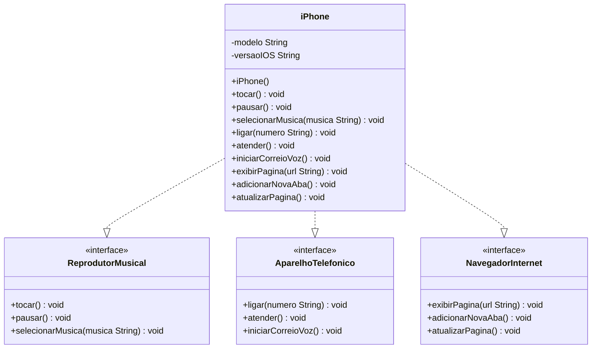

## Diagrama de Classes com Mermaid e Implementação:

```mermaid
classDiagram
    class ReprodutorMusical {
        <<interface>>
        +tocar() void
        +pausar() void
        +selecionarMusica(musica String) void
    }

    class AparelhoTelefonico {
        <<interface>>
        +ligar(numero String) void
        +atender() void
        +iniciarCorreioVoz() void
    }

    class NavegadorInternet {
        <<interface>>
        +exibirPagina(url String) void
        +adicionarNovaAba() void
        +atualizarPagina() void
    }

    class iPhone {
        -modelo String
        -versaoIOS String
        +iPhone()
        +tocar() void
        +pausar() void
        +selecionarMusica(musica String) void
        +ligar(numero String) void
        +atender() void
        +iniciarCorreioVoz() void
        +exibirPagina(url String) void
        +adicionarNovaAba() void
        +atualizarPagina() void
    }

    iPhone ..|> ReprodutorMusical
    iPhone ..|> AparelhoTelefonico
    iPhone ..|> NavegadorInternet
```

Implementado no src deste Projeto.